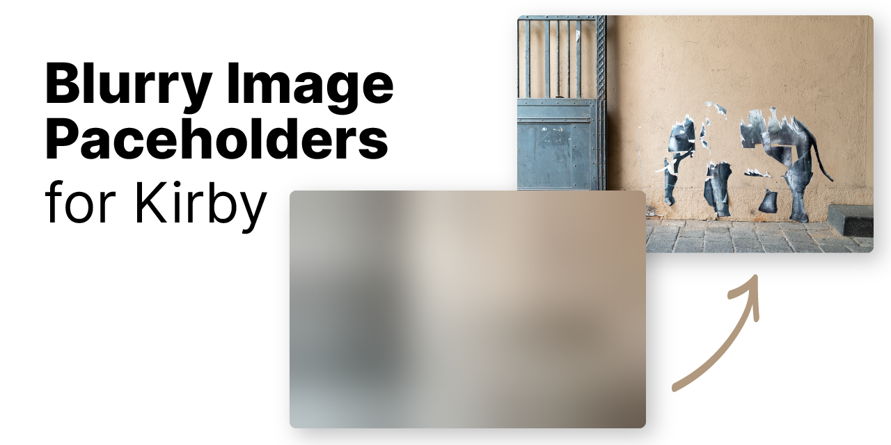

# Kirby Blurry Placeholder

This plugin implements progressive image loading, proving a better user experience. Tiny thumbnails which inherit the aspect ratio of their source image are combined with a blurry effect for a better placeholder than a solid color, without sacrificing payload.

How it works:
1. An inline, URI-encoded SVG fills the `src` attribute of a given image element. The blurred image is wrapped in a SVG to avoid rasterizing the filter.
2. The large images are then only requests when they are within the viewport.

## Key features

- ✨ Avoids content jumping (keeping aspect ratio)
- 🖼 Available as Kirbytag
- 🗃 Extends `Kirby\Cms\File` methods
- 🔍 SEO-friendly
- ⚡️ Vanilla JavaScript lazy loader included

## Requirements

- Kirby 3
- PHP 7.3+

## Installation

### Download

Download and copy this repository to `/site/plugins/kirby-blurry-placeholder`.

### Git submodule

```
git submodule add https://github.com/johannschopplich/kirby-blurry-placeholder.git site/plugins/kirby-blurry-placeholder
```

### Composer

```
composer require johannschopplich/kirby-blurry-placeholder
```

## Usage

### … As `(blurryimage: …)` Kirbytag

This plugin doesn't extend the core `(image: …)` Kirbytag, but builds upon it. So all of the options present are available in the plugin's Kirbytag as well.

The `(blurryimage: …)` tag:
- Encodes a blurry image placeholder as URI in the `src` attribute.
- Sets the original image's URL as `data-src` or a set of responsive images as `data-srcset`.
- Adds a `data-lazyload` attribute for selection by the lazy loading library.

Example use within a KirbyText field:

```
(blurryimage: myimage.jpg)
(blurryimage: myimage.jpg link: https://example.com)
(blurryimage: myimage.jpg class: is-poster)
```

If you have enabled `srcset`'s in the options, the Kirbytag syntax stays the same. Just the output changes.

### … As file method

`$file->placeholderUri()` creates and returns the URI-encoded SVG placeholder.

```html
// Using the `placeholderUri` for an inlined image in the `src` attribute
placeholderUri() ?>" data-src="<?= $image->url() ?>" data-lazyload alt="<?= $image->alt() ?>">
```

## Lazy loading in the frontend

You have two options to lazily load the larger image.

### Use the included lazyload hook

```js
import { useLazyload } from './src/useLazyload'

const observer = useLazyload()
observer.observe()
```

You may inspect the source to gain more information about options. In a nutshell, it's a SEO-friendly and modernized derivate of [lozad.js](https://github.com/ApoorvSaxena/lozad.js).

**Automatically setting the sizes attribute**

useLazyload supports setting the `sizes` attribute automatically, corresponding to the current size of your image. For this to work, the `data-sizes` attribute has to be set to `auto`. If you have `srcset`'s enabled in your configuration, this is already done for you when using the `(blurryimage: …)` Kirbytag.

### Use a lazy loader of your choice

Each parsed Kirbytag adds the `data-lazyload` attribute to the `img` element.

Thus you can let your lazy loader of choice select these elements by passing `[data-lazyload]` as selector.

> Note: A `.lazyload` class is intentionally not added to avoid potential naming conflicts. I also prefer data attributes over classes for selectors only used by JavaScript manipulation. 🤷‍♂️

## Options

> All options are namespaced under `kirby-extended.blurry-placeholder`.

| Option | Default | Description |
| --- | --- | --- |
| `pixel-target` | `60` | Aim for a placeholder image of ~P pixels (w * h = ~P). |
| `srcset.enable` | `false` | Boolean indicating if responsive images should be created when using the Kirbytag. |
| `srcset.preset` | `null` | A preset passed to Kirby's `srcset` method when using the Kirbytag. |
| `srcset.sizes` | `auto` | String for the `data-sizes` attribute when using the Kirbytag. |

> All of the `srcset` options have to be wrapped in an array.

To give an example for your `config.php`:

```php
return [
    'kirby-extended.blurry-placeholder' => [
        'pixel-target' => 75,
        'srcset' => [
            'enable' => true,
            'preset' => 'text'
        ]
    ]
]
```

## Placeholders in action

> Note: GIF is slowed down so to grasp visually how placeholders look before the image kicks in.


## Credits

- AMP's [blurry image implementation](https://github.com/ampproject/amp-toolbox/blob/0c8755016ae825b11b63b98be83271fd14cc0486/packages/optimizer/lib/transformers/AddBlurryImagePlaceholders.js)
- [lozad.js](https://github.com/ApoorvSaxena/lozad.js)

## License

[MIT](https://opensource.org/licenses/MIT)
