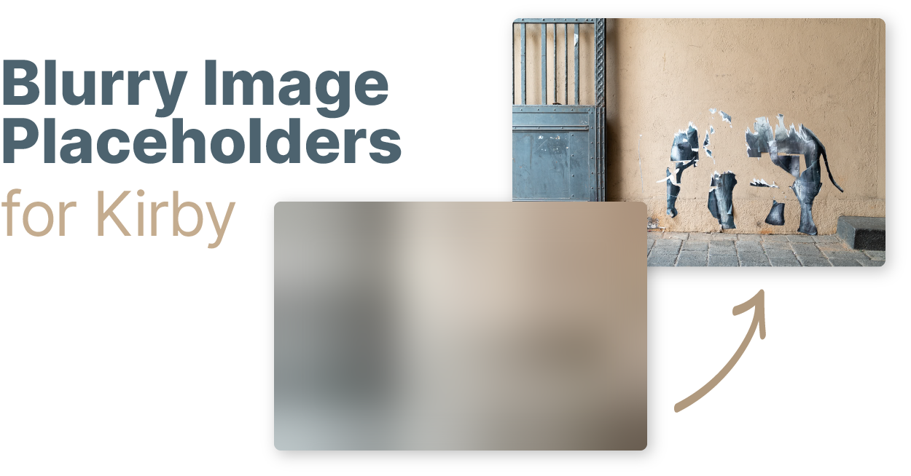
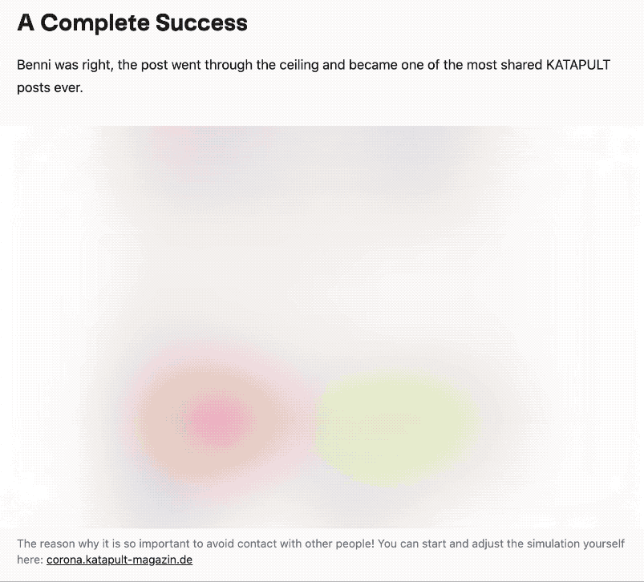

# Kirby Blurry Placeholder

This plugin implements progressive image loading, providing a better user experience. Tiny thumbnails which inherit the aspect ratio of their source image are combined with a blurry effect for a better placeholder than solid colors, without sacrificing payload.

How it works:

1. An inline, URI-encoded SVG fills the `src` attribute of a given image element. The blurred image is wrapped in a SVG to avoid rasterizing the filter.
2. The large images are then only requests when they are within the viewport.

## Key Features

- ✨ Avoids content jumping (keeping aspect ratio)
- 🏗 Available as [image block](./snippets/blocks/image.php)
- 🖼 Available in KirbyText with custom Kirbytag
- 🔍 SEO-friendly
- 🗃 Extends [file methods](https://getkirby.com/docs/reference/plugins/extensions/file-methods)
- ⚡️ Vanilla JavaScript lazy loading library included

## Requirements

- Kirby 3
- PHP 7.3+

## Installation

### Download

Download and copy this repository to `/site/plugins/kirby-blurry-placeholder`.

### Git Submodule

```
git submodule add https://github.com/johannschopplich/kirby-blurry-placeholder.git site/plugins/kirby-blurry-placeholder
```

### Composer

```
composer require johannschopplich/kirby-blurry-placeholder
```

## Usage

### As Kirby Image Block

Each Kirby site is tailored to its own use-case, thus this plugin won't add a Kirby block by default. Instead, take a look into the provided [image block example](./snippets/blocks/image.php) to get an idea of how to implement blurry placeholders within blocks.

Of course, you can just copy the block into your `site/snippets/blocks` folder of your current Kirby project, use it as is or adapt it to your needs!

### As File Method

`$file->placeholderUri()` creates and returns the URI-encoded SVG placeholder.

```php
<!-- Using the `placeholderUri` for an inlined image in the `src` attribute -->
placeholderUri() ?>"
    data-src="<?= $image->url() ?>"
    data-lazyload
    alt="<?= $image->alt() ?>"
/>
```

#### Cropped Images

> Kirby doesn't support file methods on cropped files/images, because the latter inherit the `Kirby\Cms\FileVersion` class.

Pass the ratio of a cropped image to the placeholder method to generate a cropped preview:

```php
<?php $cropped = $original->crop(500, 400) ?>
placeholderUri(5/4) ?>"
  data-src="<?= $cropped->url() ?>"
  data-lazyload
  alt="<?= $original->alt() ?>"
/>
```

### As `(blurryimage: …)` Kirbytag

This plugin doesn't overwrite the core `(image: …)` Kirbytag, but builds upon it for a custom tag. Thus, all of the options present in Kirby's `(image: …)` tag are available in the plugin's tag as well.

The `(blurryimage: …)` tag:

- Encodes a blurry image placeholder as URI in the `src` attribute.
- Sets the original image's URL as `data-src` or a set of responsive images as `data-srcset`.
- Adds a `data-lazyload` attribute for selection by the lazy loading library.

Example use within a [KirbyText](https://getkirby.com/docs/reference/text/kirbytags) field:

```
(blurryimage: myimage.jpg)
(blurryimage: myimage.jpg link: https://example.com)
(blurryimage: myimage.jpg class: is-poster)
```

If you have enabled `srcset`'s in the options, the Kirbytag syntax stays the same. Just the output changes.

## Lazy Loading in the Frontend

To lazily load the images once they get apparent in the viewport, a JavaScript library is necessary.

I strongly recommend [🦌 Loadeer.js](https://github.com/johannschopplich/loadeer). It has been written with this Kirby plugin in mind. In a nutshell, it's a tiny, performant, SEO-friendly lazy loading library and can be used with or without a build step if you don't have a frontend asset build chain.

> ℹ️ Since v1.3.0, the [lazy loading hook](./src/useLazyload.js) provided by this plugin has been replaced by Loadeer.js – a rewritten version of the former hook.

### Without Build Step & Auto Initialization

Simply load it from a CDN:

```html
<script src="https://unpkg.com/loadeer" defer init></script>
```

- The `defer` attribute makes the script execute after HTML content is parsed.
- The `init` attribute tells Loadeer.js to automatically initialize and watch all elements that have a `data-lazyload` attribute.

### Import As ES Module

You can use the ES module build by installing the `loadeer` npm package:

```js
import Loadeer from "loadeer";

const instance = new Loadeer();
loadeer.observe();
```

### Automatically Calculate the `sizes` Attribute

Loadeer.js supports setting the `sizes` attribute automatically, corresponding to the current size of your image. For this to work, the `data-sizes` attribute has to be set to `auto`. If you have `srcset`'s enabled in your configuration, this is already done for you when using the `(blurryimage: …)` Kirbytag.

### Use a Lazy Loader of Your Choice

Each parsed Kirbytag adds the `data-lazyload` attribute to the `img` element. Consequently, you can let a lazy loader of choice select these elements by passing `[data-lazyload]` as selector.

## Options

> All options listed have to be prefixed with `kirby-extended.blurry-placeholder.` in your `config.php`.

| Option                   | Default | Description                                                                                                                                                                                                                    |
| ------------------------ | ------- | ------------------------------------------------------------------------------------------------------------------------------------------------------------------------------------------------------------------------------ |
| `pixel-target`           | `60`    | Aim for a placeholder image of ~P pixels (`w \* h = ~P`).                                                                                                                                                                      |
| `kirbytag.srcset-preset` | `null`  | A preset passed to [Kirby's `srcset` method](https://getkirby.com/docs/reference/objects/cms/file/srcset#define-presets) when using the Kirbytag. If `null` (default), a `src` attribute will be rendered instead of `srcset`. |
| `kirbytag.sizes`         | `auto`  | String for the `data-sizes` attribute if the Kirbytag works with `srcset`'s.                                                                                                                                                   |

> All of the `srcset` options have to be wrapped in an array.

To give an example for your `config.php`:

```php
return [
    'kirby-extended.blurry-placeholder' => [
        'pixel-target' => 60,
        'kirbytag' => [
            'srcset-preset' => 'article'
        ]
    ]
];
```

## Placeholders in action

> Note: GIF is slowed down so to grasp visually how placeholders look before the image kicks in.



## Credits

- AMP's [blurry image implementation](https://github.com/ampproject/amp-toolbox/blob/0c8755016ae825b11b63b98be83271fd14cc0486/packages/optimizer/lib/transformers/AddBlurryImagePlaceholders.js)

## License

[MIT](https://opensource.org/licenses/MIT)
